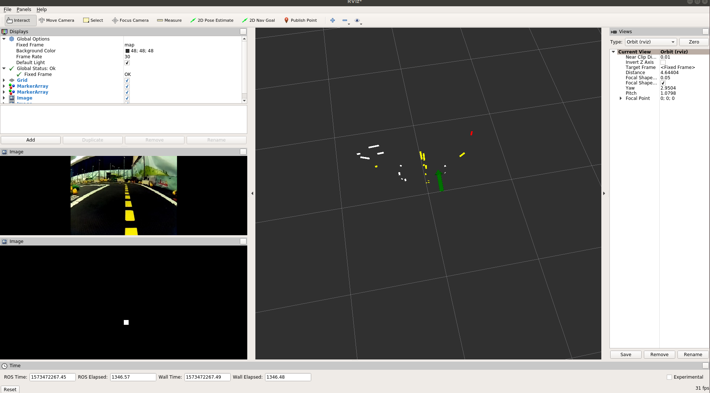

# Exercises - lane pose estimation {#exercise-localization status=ready}

Excerpt: Understand the components of the imaging pipelime: from image to localization.

The goal of this exercise is to familiarize us with the pipeline that extract lane localization from the image stream. This is the base of the lane following demo.

  Requires: [Camera calibration](+opmanual_duckiebot#camera-calib)

  Requires: [Docker basics](+duckietown-robotics-development#docker-basics)

  Requires: [ROS basics](+duckietown-robotics-development#sw-advanced)

  Requires: [Knowledge of the software architecture on a Duckiebot](+duckietown-robotics-development#duckietown-code-structure)

  Results: Understand the trade-offs when dealing with image processing parameters

  Results: Insights into the image pipeline of a duckiebot.

## Introduction

Determining its own position in the lane is essential for any Duckiebot to survive in the city. In the following section we will go step by step through the various steps of the image pipeline: from image to position.

Fig. 4.1 shows the 2 important parts of the localization, the **line detector** and the **lane filter**, and where they stand in the whole image to control pipeline. The control aspect will be the focus of the next set of exercises. We will focus here only on the two above-mentioned parts.

<figure>
  
</figure>

## Line detector node

### Role of the node

The line detector node is responsible for detecting lines in the field of view of the Duckiebot, of three different colours: red, white and yellow.

### Ros interfacing of the node

**The line detector node subscribes to:**

* The corrected image stream

**The line detector node publishes:**

* Segment list (type: SegmentList.msg) is an array which saves all segments (type: Segment.msg) found in the image. A segment consists of colour (red, yellow, white) and 2D vector (startpoint, endpoint).

## Lane filter node

### Role of the node

The lane filter node is responsible for estimating the position of the Duckiebot with respect to the center of the driving lane.  

### Ros interfacing of the node

**The lane filter node subscribes to:**

* The segment list from the line detector node

**The lane filter node publishes:**

Lane pose (type: duckietown_msgs/lane_pose) is struct with the following parameters which are currently in use:
  
  1. d (float32) the lateral offset, where d = 0 is the middle of the right lane
  2. phi (float32) the angle from the center of the lane to the orientation of the duckiebot

Note: When the duckiebot is perfectly aligned in the center of its lane, facing forward, this estimation should be (d = 0.0, phi = 0.0)

### Bayes filter

Bayes filters are a probabilistic tool for estimating the state of dynamic systems. In the case of our Duckiebot, given a stream of observation (in this case the camera image) we compute a measurement likelihood matrix with a histogram filter. This enable us to calculate an initial belief. Then, we project the belief of the previous time step to the current time step. We can do this in the following way:

belief (t+1) = belief(t) * measurement_likelihood(t)

From the belief, we then extract the pose d and angle phi with the highest probability.

### Histogram filter

Each 2d white and yellow segments are projected onto the Duckiebots reference frame. Then the horizontal distance from the white/yellow segment to the desired position (middle point between right white lane and yellow lane) is calculated. The same is done for the angle phi. For all the segments a histogram is calculated which can be then display under as an image stream.

Snippet of the the generation of votes for the histogram filter

    #Generation of votes for the the histogram filter
    def generateVote(self, segment):
        p1 = np.array([segment.points[0].x, segment.points[0].y])
        p2 = np.array([segment.points[1].x, segment.points[1].y])
        t_hat = (p2 - p1) / np.linalg.norm(p2 - p1)

        n_hat = np.array([-t_hat[1], t_hat[0]])
        d1 = np.inner(n_hat, p1)
        d2 = np.inner(n_hat, p2)
        l1 = np.inner(t_hat, p1)
        l2 = np.inner(t_hat, p2)
        if (l1 < 0):
            l1 = -l1
        if (l2 < 0):
            l2 = -l2

        l_i = (l1 + l2) / 2
        d_i = (d1 + d2) / 2
        phi_i = np.arcsin(t_hat[1])
        if segment.color == segment.WHITE:  # right lane is white
           if(p1[0] > p2[0]):  # right edge of white lane
               d_i = d_i - self.linewidth_white
           else:  # left edge of white lane
               d_i = - d_i
               phi_i = -phi_i
           d_i = d_i - self.lanewidth        
           elif segment.color == segment.YELLOW:  # left lane is yellow
           if (p2[0] > p1[0]):  # left edge of yellow lane
               d_i = d_i - self.linewidth_yellow
               phi_i = -phi_i
           else:  # right edge of white lane
               d_i = -d_i
           d_i = - d_i

           weight = 1
           d_i += self.center_lane_offset

           return d_i, phi_i, l_i, weight

## Helpful tools

### The belief histogram

To see the belief histogram, run:

    laptop $ dts start_gui_tools

and then

    laptop-container $ rqt_image_view

Select the topic : `/DUCKIEBOT_NAME/lane_filter_node/belief_img`.

### Rviz

Rviz (ROS visualization) is a 3D visualizer for displaying sensor data and state information from ROS. More on information can be found here: http://wiki.ros.org/rviz

For this exercise rviz will be helpful to display sensor messages from the Duckiebot. In order to run rviz run:By selecting the appropriate topic we can output desired information. In particular xxxx and xxx will be useful in this exercise.

<figure>

</figure>

To start rviz run the following command

    laptop $ dts start_gui_tool ![DUCKIEBOT_NAME]

and then

    laptop-container $ rviz
  
**Rosparameter manipulation:**

TODO: Tomasz : say how to run everything with the same gui_tools container !

As a reminder: for rosparameter introspection and manipulation we recommend the following steps:

    laptop $ dts start_gui_tools ![DUCKIEBOT_NAME]

1) Listing the parameters:

    container $ rosparam list

2) Getting the parameters:

    container $ rosparam get parameter_name

3) Setting the parameters:

    container $ rosparam set parameter_name value

## Instructions

### Task 1: Line detector exercise

As previously introduced, the `line_detector_node` detects white, yellow and red segments. The more segments we get, the more accurate we expect the lane filter to be, but also the more resources we need for computation of the pose estimate (memory as well as cpu). This is a trade-off of accuracy versus computation efficiency. The goal of this exercise is to analyze this trade-off by determining the relationship between the number of segments processed and the quality and frequency of pose estimates that are being computed.

For this task the parameter `/DUCKIEBOT_NAME/line_detector_node/segment_max_threshold` can be dynamically adjusted.

#### Choosing the maximum number of segments {#exercise:lineDetector}

While running the exercise provided lane following, play with `/DUCKIEBOT_NAME/line_detector_node/segment_max_threshold`, and record different rosbags (One for each value of `segment_max_threshold`).

Write a custom python script to analyse the frequency of the topic `/DUCKIEBOT_NAME/lane_filter_node/lane_pose` for each bag. Plot the relationship between `segment_max_threshold` on one axis and the mean and standard deviation of the lane_pose frequency on the other axis (provide at least 4 points on the plot). Include a point with a very high `segment_max_threshold`, to virtually allow all segments to be computed.

But frequency isn't the only relevant metric. Using one segment per color will give fast computation but very noisy and unstable estimation. Using the `rviz` tools that you launched before, estimate the stability of the estimation and find out the minimal number for `segment_max_threshold` that keeps a stable estimation.

<end/>

### Task 2: Lane pose exercise

As outlined in the introduction section, the lane_filter_node estimates the Duckiebot desired pose by means of recursive Bayes estimation. As a lever we can change the size of the belief/likelihood matrices. Therefore we are interested in analyzing the effect of various matrix sizes on the precision/standard deviation of the lane pose. For this task the following parameter will be dynamically adjusted:

* `/BOT_NAME/lane_filter_node/matrix_rescale`

#### Choosing the best matrix size {#exercise:laneFilter}

While running the exercise provided lane following, play with `matrix_rescale`, and record different rosbags (One for each value of `matrix_rescale`).

Write a custom python script to analyse the frequency of the topic `/DUCKIEBOT_NAME/lane_filter_node/lane_pose` for each bag (should be the same as last exercise). Plot the relationship between `matrix_rescale` on one axis and the the mean and standard deviation of the frequency of the `lane_pose` topic on the other axis (provide at least 4 points on the plot).

<end/>

### Task 3: English driver

One of our brave Duckiebots wanted to make a visit to Great Britain before Brexit happens. However, it needs to adhere to the local driving rules. Therefore it need to learn to drive on the left side of the road.

#### Driving the english style {#exercise:englishDriver}

The task is to make the Duckiebot drive on the left side of the road. An appropriate parameter in the code snippet provided above is sufficient to finish this task.

<end/>