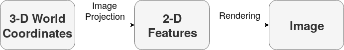
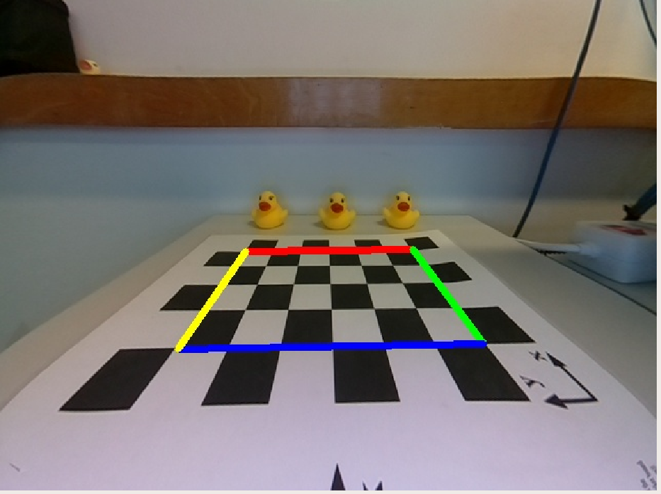
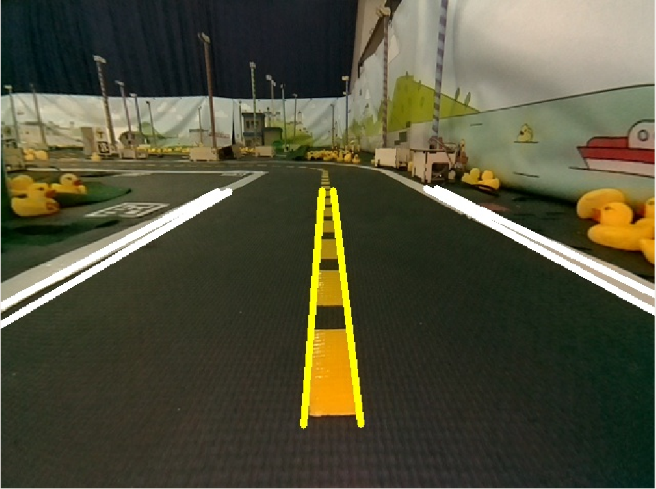

# Exercise: Augmented Reality {#exercise-augmented-reality status=ready}

Excerpt: Apply your competences in software development in a perception pipeline.

The goal of this exercise is to familiarize yourself in developing functionalities in the framemork of a pre-existing pipeline.
In particular the focus is in the perception pipeline, where you will implement a computer graphics algorithm.


<div class='requirements' markdown='1'>
  Requires: [Camera calibration](+opmanual_duckiebot#camera-calib)

  Requires: [Docker basics](+duckietown-robotics-development#docker-basics)

  Requires: [ROS basics](+duckietown-robotics-development#sw-advanced)

  Requires: [Knowledge of the software architecture on a Duckiebot](+duckietown-robotics-development#duckietown-code-structure)

  Results: Skills on how to develop new code as part of the Duckietown framework

  Results: Insights into a computer graphics pipeline.
</div>


## Introduction

During lectures, we explained one direction of the image pipeline:

<figure>
  
</figure>

In this exercise, we are going to look at the pipeline in the opposite direction.

It is often said that:

> "The inverse of computer vision is computer graphics."

The inverse pipeline looks like this:
<figure>
  
</figure>
In simple words, instead of extracting information from our camera, we want to introduce some data in the imagery.


## Instructions


* Ensure that you have already done intrinsics and extrinsics [camera calibration]() of your robot.
* Create a package called `augmented_reality` with functionalities specified below in [](#exercise-augmented-reality-spec).


Then verify the results in the following 3 situations.


### Situation 1: Calibration pattern

* Put the robot in the middle of the calibration pattern.
* Run the node `augmented_reality` with map file `calibration_pattern.yaml`.

(Adjust the position of your Duckiebot until you get a decent match of reality and augmented reality.)

### Situation 2: Lane

* Put the robot in the middle of a lane.
* Run the node `augmented_reality` with map file `lane.yaml`.

(Adjust the position of your Duckiebot of your Duckiebot until you get a decent match of reality and augmented reality.)

### Situation 3: Intersection

* Put the robot at a stop line at a 4-way intersection in Duckietown.
* Run the node `augmented_reality` with map file `intersection_4way.yaml`.

(Adjust the position of your Duckiebot until you get a decent match of reality and augmented reality.)

## Specification of `augmented_reality` {#exercise-augmented-reality-spec}

In this assignment you will be writing a ROS package to perform the augmented reality exercise. The program will be invoked with the following syntax:

    container $ roslaunch augmented_reality augmented_reality.launch map_file:=![map file] robot_name:=![robot name]

where `![map file]` is a YAML file containing the map (specified in [](#exercise-augmented-reality-map)).

The package structure *must* be the one provided by the [Duckietown template-ros](https://github.com/duckietown/template-ros),
in addition, create a map folder where you can store the map files.

The program does the following:

1. It loads the intrinsic / extrinsic calibration parameters for the given robot.
2. It reads the map file, using the map file given in the roslaunch command.
3. It listens to the image topic `/![robot name]/camera_node/image/compressed`.
4. It reads each image, projects the map features onto the image, and then writes the resulting image to the topic `/![robot name]/![node_name]/![map file basename]/image/compressed`

where `![map file basename]` is the basename of the file without the extension.

<!-- We provide you with ROS package template that contains the `AugmentedRealityNode`. By default, launching the `AugmentedRealityNode` should publish raw images from the camera on the new `/![robot name]/AR/![map file basename]/image/compressed` topic. -->

To complete the exercise, create a ROS node called `augmented_reality_node`, which imports an `Augmenter` class, from an `augmented_reality` module.
The class should contain the following methods:

1. A method called `process_image` that undistorts raw images.
2. A method called `ground2pixel` that transforms points in ground coordinates (i.e. the robot reference frame) to pixels in the image.
3. A method called `render_segments` that adds the segments from the map files to the image.

In the ROS node, you just need a callback that uses the above specified class to modify the input image, so:

1. Implement a method called `callback` that writes the augmented image to the appropriate topic.

## Specification of the map {#exercise-augmented-reality-map}

The map file contains a 3D polygon, defined as a list of points and a list of segments
that join those points.

The format is similar to any data structure for 3D computer graphics, with a few changes:

1. Points are referred to by name.
2. It is possible to specify a reference frame for each point. (This will help make this into
a general tool for debugging various types of problems).

Here is an example of the file contents, hopefully self-explanatory.

The following map file describes 3 points, and two lines.

    points:
        # define three named points: center, left, right
        center: [axle, [0, 0, 0]] # [reference frame, coordinates]
        left: [axle, [0.5, 0.1, 0]]
        right: [axle, [0.5, -0.1, 0]]
    segments:
    - points: [center, left]
      color: [rgb, [1, 0, 0]]
    - points: [center, right]
      color: [rgb, [1, 0, 0]]


### Reference frame specification

The reference frames are defined as follows:

- `axle`: center of the axle; coordinates are 3D.
- `camera`: camera frame; coordinates are 3D.
- `image01`: a reference frame in which 0,0 is top left, and 1,1 is bottom right of the image; coordinates are 2D.

(Other image frames will be introduced later, such as the `world` and `tile` reference frame, which
need the knowledge of the location of the robot.)

### Color specification

RGB colors are written as:

    [rgb, [![R], ![G], ![B]]]

where the RGB values are between 0 and 1.

Moreover, we support the following strings:

- `red` is equivalent to `[rgb, [1,0,0]]`
- `green` is equivalent to `[rgb, [0,1,0]]`
- `blue` is equivalent to `[rgb, [0,0,1]]`
- `yellow` is equivalent to `[rgb, [1,1,0]]`
- `magenta` is equivalent to `[rgb, [1,0,1]]`
- `cyan` is equivalent to `[rgb, [0,1,1]]`
- `white` is equivalent to `[rgb, [1,1,1]`
- `black` is equivalent to `[rgb, [0,0,0]]`


## "Map" files


### `hud.yaml`

This pattern serves as a simple test that we can draw lines in image coordinates:

    points:
        TL: [image01, [0, 0]]
        TR: [image01, [0, 1]]
        BR: [image01, [1, 1]]
        BL: [image01, [1, 0]]
    segments:
    - points: [TL, TR]
      color: red
    - points: [TR, BR]
      color: green
    - points: [BR, BL]
      color: blue
    - points: [BL, TL]
      color: yellow

The expected result is to put a border around the image:
red on the top, green on the right, blue on the bottom, yellow on the left.

### `calibration_pattern.yaml`

This pattern is based off the checkerboard calibration target used in estimating the intrinsic and extrinsic camera parameters:


    points:
        TL: [axle, [0.315, 0.093, 0]]
        TR: [axle, [0.315, -0.093, 0]]
        BR: [axle, [0.191, -0.093, 0]]
        BL: [axle, [0.191, 0.093, 0]]
    segments:
    - points: [TL, TR]
      color: red
    - points: [TR, BR]
      color: green
    - points: [BR, BL]
      color: blue
    - points: [BL, TL]
      color: yellow

The expected result is to put a border around the inside corners of the checkerboard: red on the top, green on the right, blue on the bottom, yellow on the left, like below.

<figure>
  
</figure>

### `lane.yaml`

We want something like this:

                      0
     |   |          | . |             |   |
     |   |          | . |             |   |
     |   |          | . |             |   |
     |   |          | . |             |   |
     |   |          | . |             |   |
     |   |          | . |             |   |
      WW      L       WY      L         WW
     1   2          3   4             5   6

Then we have:

    points:
         p1: [axle, [0.15, 0.2794, 0]]
         q1: [axle, [0.6096, 0.2794, 0]]
         p2: [axle, [0.15, 0.2286, 0]]
         q2: [axle, [0.6096, 0.2286, 0]]
         p3: [axle, [0.15, 0.0127, 0]]
         q3: [axle, [0.6096, 0.0127, 0]]
         p4: [axle, [0.15, -0.0127, 0]]
         q4: [axle, [0.6096, -0.0127, 0]]
         p5: [axle, [0.15, -0.2286, 0]]
         q5: [axle, [0.6096, -0.2286, 0]]
         p6: [axle, [0.15, -0.2794, 0]]
         q6: [axle, [0.6096, -0.2794, 0]]
    segments:
     - points: [p1, q1]
       color: white
     - points: [p2, q2]
       color: white
     - points: [p3, q3]
       color: yellow
     - points: [p4, q4]
       color: yellow
     - points: [p5, q5]
       color: white
     - points: [p6, q6]
       color: white

Expected output:
<figure>
  
</figure>

### `intersection_4way.yaml`

    points:
        NL1: [axle, [0.247, 0.295, 0]]
        NL2: [axle, [0.347, 0.301, 0]]
        NL3: [axle, [0.218, 0.256, 0]]
        NL4: [axle, [0.363, 0.251, 0]]
        NL5: [axle, [0.400, 0.287, 0]]
        NL6: [axle, [0.409, 0.513,   0]]
        NL7: [axle, [0.360, 0.314, 0]]
        NL8: [axle, [0.366, 0.456, 0]]
        NC1: [axle, [0.372, 0.007, 0]]
        NC2: [axle, [0.145, 0.008, 0]]
        NC3: [axle, [0.374, -0.0216, 0]]
        NC4: [axle, [0.146, -0.0180, 0]]
        NR1: [axle, [0.209, -0.234, 0]]
        NR2: [axle, [0.349, -0.237, 0]]
        NR3: [axle, [0.242, -0.276, 0]]
        NR4: [axle, [0.319, -0.274, 0]]
        NR5: [axle, [0.402, -0.283, 0]]
        NR6: [axle, [0.401, -0.479, 0]]
        NR7: [axle, [0.352,  -0.415, 0]]
        NR8: [axle, [0.352, -0.303, 0]]
        CL1: [axle, [0.586, 0.261, 0]]
        CL2: [axle, [0.595, 0.632, 0]]
        CL3: [axle, [0.618, 0.251, 0]]
        CL4: [axle, [0.637, 0.662, 0]]
        CR1: [axle, [0.565, -0.253, 0]]
        CR2: [axle, [0.567, -0.607, 0]]
        CR3: [axle, [0.610, -0.262, 0]]
        CR4: [axle, [0.611, -0.641, 0]]
        FL1: [axle, [0.781, 0.718, 0]]
        FL2: [axle, [0.763, 0.253, 0]]
        FL3: [axle, [0.863, 0.192, 0]]
        FL4: [axle, [1.185, 0.172, 0]]
        FL5: [axle, [0.842, 0.718, 0]]
        FL6: [axle, [0.875, 0.271,   0]]
        FL7: [axle, [0.879, 0.234, 0]]
        FL8: [axle, [1.180, 0.209, 0]]
        FC1: [axle, [0.823, 0.0162, 0]]
        FC2: [axle, [1.172, 0.00117, 0]]
        FC3: [axle, [0.845, -0.0100, 0]]
        FC4: [axle, [1.215, -0.0181, 0]]
        FR1: [axle, [0.764, -0.695, 0]]
        FR2: [axle, [0.768, -0.263, 0]]
        FR3: [axle, [0.810, -0.202, 0]]
        FR4: [axle, [1.203, -0.196, 0]]
        FR5: [axle, [0.795, -0.702, 0]]
        FR6: [axle, [0.803, -0.291, 0]]
        FR7: [axle, [0.832, -0.240, 0]]
        FR8: [axle, [1.210, -0.245, 0]]
    segments:
    - points: [NL1, NL2]
      color: white
    - points: [NL3, NL4]
      color: white
    - points: [NL5, NL6]
      color: white
    - points: [NL7, NL8]
      color: white
    - points: [NC1, NC2]
      color: yellow
    - points: [NC3, NC4]
      color: yellow
    - points: [NR1, NR2]
      color: white
    - points: [NR3, NR4]
      color: white
    - points: [NR5, NR6]
      color: white
    - points: [NR7, NR8]
      color: white
    - points: [CL1, CL2]
      color: yellow
    - points: [CL3, CL4]
      color: yellow
    - points: [CR1, CR2]
      color: yellow
    - points: [CR3, CR4]
      color: yellow
    - points: [FL1, FL2]
      color: white
    - points: [FL3, FL4]
      color: white
    - points: [FL5, FL6]
      color: white
    - points: [FL7, FL8]
      color: white
    - points: [FC1, FC2]
      color: yellow
    - points: [FC3, FC4]
      color: yellow
    - points: [FR1, FR2]
      color: white
    - points: [FR3, FR4]
      color: white
    - points: [FR5, FR6]
      color: white
    - points: [FR7, FR8]
      color: white


## Suggestions

Start by using the file `hud.yaml`. To visualize it, you do not need the
calibration data. It will be helpful to make sure that you can do the easy
parts of the exercise: loading the map, and drawing the lines.

To write the segments you can use this function:
```python
def draw_segment(self, image, pt_x, pt_y, color):
    defined_colors = {
        'red': ['rgb', [1, 0, 0]],
        'green': ['rgb', [0, 1, 0]],
        'blue': ['rgb', [0, 0, 1]],
        'yellow': ['rgb', [1, 1, 0]],
        'magenta': ['rgb', [1, 0 , 1]],
        'cyan': ['rgb', [0, 1, 1]],
        'white': ['rgb', [1, 1, 1]],
        'black': ['rgb', [0, 0, 0]]}
    _color_type, [r, g, b] = defined_colors[color]
    cv2.line(image, (pt_x[0], pt_y[0]), (pt_x[1], pt_y[1]), (b * 255, g * 255, r * 255), 5)
    return image
```

For other functionalities (i.e. loading calibration files), it could make sense to spend some time in looking into the existing Duckietown code.


<!-- ## Useful APIs

### Loading a map file:

To load a map file, use the function `load_map` provided in `duckietown_utils`:

    from duckietown_utils import load_map

    map_data = load_map(map_filename)

(Note that `map` is a reserved symbol name in Python.)

### Reading the calibration data for a robot

To load the _intrinsic_ calibration parameters, use the function `load_camera_intrinsics` provided in `duckietown_utils`:

    from duckietown_utils import load_camera_intrinsics

    intrinsics = load_camera_intrinsics(robot_name)

To load the _extrinsic_ calibration parameters (i.e. ground projection), use the function `load_homography` provided in `duckietown_utils`:

    from duckietown_utils import load_homography

    H = load_homography(robot_name)

### Path name manipulation

From a file name like `"/path/to/map1.yaml"`, you can obtain the basename without extension `yaml` by using the function `get_base_name` provided in `duckietown_utils`:

    from duckietown_utils import get_base_name

    filename = "/path/to/map1.yaml"
    map_name = get_base_name(filename) # = "map1"

### Undistorting an image

To remove the distortion from an image, use the function `rectify` provided in `duckietown_utils`:

    from duckietown_utils import rectify

    rectified_image = rectify(image, intrinsics)

### Drawing primitives

To draw the line segments specified in a map file, use the `render_segments` method defined in the `Augmenter` class:

    class Augmenter():

        # ...

        def ground2pixel(self):
            '''Method that transforms ground points
            to pixel coordinates'''
            # Your code goes here.
            return "???"


    image_with_drawn_segments = augmenter.render_segments(image)


In order for `render_segments` to draw segments on an image, you must first implement the method `ground2pixel`. -->
